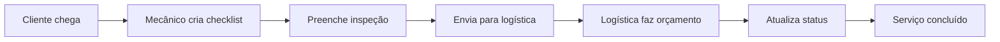

# 🔧 Sistema de Checklist para Oficina

Sistema web completo para gerenciamento de checklists automotivos e controle logístico em oficinas mecânicas.


## 🎯 Objetivo

Facilitar o fluxo de trabalho entre mecânicos e setor de logística, permitindo um controle eficiente das ordens de serviço, desde a inspeção inicial até o orçamento e conclusão dos serviços.

## ✨ Funcionalidades Principais

### 👨‍🔧 Para Mecânicos
- ✅ **Login seguro** com credenciais específicas
- 🔍 **Busca automática por placa** - Digite a placa e os dados do veículo são preenchidos automaticamente
- 📋 **Checklist digital completo** com itens pré-definidos:
  - Motor (óleo, arrefecimento)
  - Sistema de freios (pastilhas, discos)
  - Pneus (calibragem, desgaste)
  - Suspensão (amortecedores)
  - Sistema elétrico (bateria, luzes)
  - Transmissão (óleo do câmbio)
- 📝 **Formulário detalhado** para dados do cliente e veículo
- 💬 **Área de observações** para anotar problemas específicos
- 📊 **Histórico pessoal** dos checklists criados

### 📊 Para Logística
- 🎛️ **Dashboard completo** com contadores em tempo real
- 👀 **Visualização detalhada** de todos os checklists enviados
- 🔄 **Sistema de status** para acompanhar progresso:
  - 🟡 Pendente
  - 🔵 Em Andamento  
  - 🟢 Finalizado
- 💰 **Base para orçamentos** e controle de peças
- 📈 **Gestão de fluxo** de trabalho

## 🆓 **APIs 100% Gratuitas e Ilimitadas**

### 🏛️ **SINESP** (Sistema Nacional de Informações de Segurança Pública)
- **Preço:** 🆓 Completamente gratuito e ilimitado
- **Dados:** Marca, modelo, ano, cor, motor
- **Base:** Dados oficiais do governo brasileiro
- **Status:** ✅ Já configurado no sistema

### 🔍 **Como Funciona**
1. **Digite a placa** no formato ABC1234 ou ABC1D23
2. **Clique em "Buscar Dados do Veículo"**
3. **Sistema consulta SINESP automaticamente**
4. **Dados preenchidos:** Marca Modelo Ano - Motor: tipo

### 🏷️ **Placas de Teste Expandidas**
Para testar, use estas placas (base de demonstração):
- `ABC1234` → Honda Civic 2018 - Motor: 2.0 16V
- `DEF5678` → Toyota Corolla 2020 - Motor: 2.0 VVT-i
- `GHI9012` → Volkswagen Gol 2019 - Motor: 1.0 TSI
- `JKL3456` → Ford Ka 2021 - Motor: 1.0 Ti-VCT
- `MNO7890` → Chevrolet Onix 2022 - Motor: 1.0 Turbo
- `PQR1357` → Fiat Palio 2017 - Motor: 1.0 Fire
- `STU2468` → Hyundai HB20 2020 - Motor: 1.0 KAPPA
- `VWX3691` → Renault Sandero 2019 - Motor: 1.0 SCe

### ⚡ **Vantagens do SINESP**
- ✅ **Gratuito e ilimitado** - sem custos ou limites
- ✅ **Base oficial** - dados do governo brasileiro
- ✅ **Sem cadastro** - funciona imediatamente
- ✅ **Dados essenciais** - marca, modelo, ano, motor
- ✅ **Já configurado** - funciona sem setup adicional

### ⚠️ **Limitações do SINESP**
- ❌ **Instabilidade** - pode ficar offline às vezes
- ❌ **Velocidade** - pode ser mais lento que APIs pagas
- ❌ **Dados limitados** - menos informações que APIs premium

### 1. Acesso Rápido
- Abra o arquivo `index.html` em qualquer navegador
- Ou acesse a versão online: [Link do GitHub Pages]

### 2. Credenciais de Teste
| Tipo | Usuário | Senha | Acesso |
|------|---------|--------|--------|
| 👨‍🔧 Mecânico | `mecanico` | `123` | Criar e gerenciar checklists |
| 📊 Logística | `logistica` | `123` | Visualizar e controlar ordens |

### 3. Fluxo de Trabalho


## 🎨 Design

### Identidade Visual
- **Cores principais:** Preto e Laranja forte (#ff6b35)
- **Estilo:** Moderno, profissional e responsivo
- **Compatibilidade:** Desktop, tablet e mobile

### Recursos Visuais
- 🌟 Animações suaves e efeitos hover
- 📱 Design totalmente responsivo
- 🔔 Notificações visuais em tempo real
- 🎯 Interface intuitiva e fácil navegação

## 🛠️ Tecnologias Utilizadas

- **HTML5** - Estrutura semântica
- **CSS3** - Estilização moderna com gradientes e animações
- **JavaScript Vanilla** - Lógica de negócio e interatividade
- **Design Responsivo** - Mobile-first approach

## 📱 Compatibilidade

| Dispositivo | Status | Observações |
|-------------|--------|-------------|
| 🖥️ Desktop | ✅ Completo | Experiência completa |
| 📱 Mobile | ✅ Otimizado | Interface adaptada |
| 📟 Tablet | ✅ Otimizado | Layout flexível |

## 🔧 Instalação e Deploy

### Instalação Local
```bash
# Clone o repositório
git clone https://github.com/seu-usuario/oficina-checklist-system.git

# Entre na pasta
cd oficina-checklist-system

# Abra o index.html no navegador
open index.html
```

### Deploy Gratuito

#### GitHub Pages
1. Vá em Settings → Pages
2. Selecione "Deploy from a branch"
3. Escolha "main" branch
4. Salve e aguarde alguns minutos

#### Netlify
1. Acesse [netlify.com](https://netlify.com)
2. Arraste o arquivo `index.html`
3. Pronto! Site no ar

#### Vercel
1. Conecte seu repositório GitHub
2. Deploy automático a cada commit

## 🔒 Segurança

### ⚠️ Para Uso em Produção

Este sistema foi desenvolvido para demonstração. Para uso em produção real, recomenda-se:

- 🔐 **Autenticação robusta** (JWT, OAuth)
- 🗄️ **Banco de dados real** (MySQL, PostgreSQL)
- 🔒 **HTTPS obrigatório**
- 🛡️ **Validação server-side**
- 💾 **Backup automático dos dados**
- 👥 **Controle de permissões por usuário**

## 📈 Melhorias Futuras

### Versão 2.0 (Planejada)
- [ ] 💰 Sistema completo de orçamentos
- [ ] 📧 Notificações por email/SMS
- [ ] 📊 Relatórios e dashboards avançados
- [ ] 🏪 Cadastro de fornecedores e peças
- [ ] 📱 App mobile nativo
- [ ] 🖨️ Sistema de impressão
- [ ] 📸 Upload de fotos dos problemas
- [ ] ⏰ Agendamento de serviços

### Integrações Possíveis
- [ ] 💳 Gateway de pagamento
- [ ] 📱 WhatsApp Business API
- [ ] 🗺️ Integração com maps
- [ ] 📋 ERP/CRM existente

## 🤝 Contribuições

Contribuições são bem-vindas! Para contribuir:

1. Fork o projeto
2. Crie uma branch para sua feature (`git checkout -b feature/AmazingFeature`)
3. Commit suas mudanças (`git commit -m 'Add some AmazingFeature'`)
4. Push para a branch (`git push origin feature/AmazingFeature`)
5. Abra um Pull Request

## 📄 Licença

Este projeto está sob a licença MIT. Veja o arquivo `LICENSE` para mais detalhes.

## 📞 Suporte

Encontrou algum bug ou tem sugestões?

- 🐛 Abra uma [Issue](https://github.com/seu-usuario/oficina-checklist-system/issues)
- 💬 Entre em contato: [seu-email@exemplo.com]

## 👨‍💻 Autor

Desenvolvido para otimizar o fluxo de trabalho em oficinas mecânicas.

---

⭐ **Gostou do projeto? Deixe uma estrela!** ⭐
